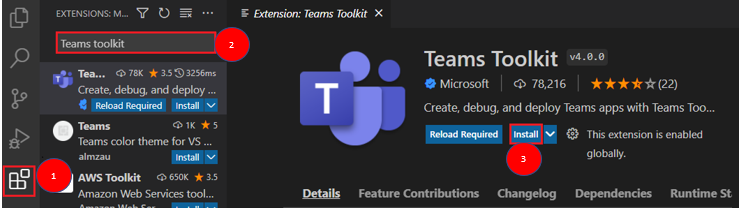
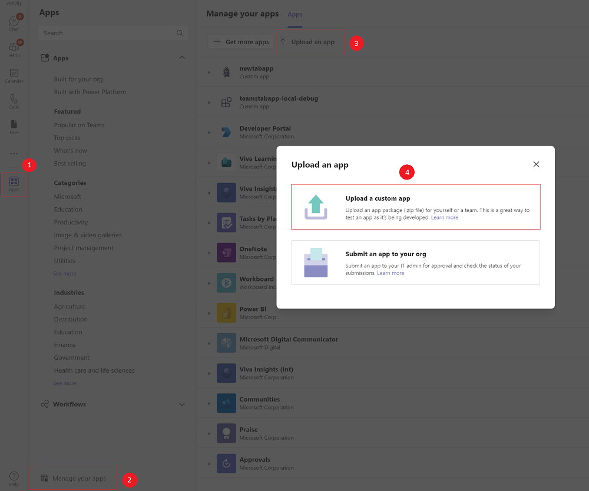

# Pre-requisites

- [Node.js](https://nodejs.org/en/download/).
- [Visual Studio Code](https://code.visualstudio.com/download) with the following extensions:
  - [Teams Toolkit](https://aka.ms/teams-toolkit).
  - [Azure Account](https://marketplace.visualstudio.com/items?itemName=ms-vscode.azure-account).
- [Teams](https://teams.microsoft.com/downloads) installed and you have an account (not a guest account).

## Install the Teams Toolkit

The Microsoft Teams Toolkit helps simplify the development process with tools to provision and deploy cloud resources for your app, publish to the Teams store, and more.

You can use the toolkit with Visual Studio Code, or CLI (command-line interface), called TeamsFx.

1. Open Visual Studio Code and select the Extensions view (Ctrl+Shift+X / ⌘⇧-X or View > Extensions).

2. In the search box, enter Teams toolkit.

3. Select Install next to the Teams Toolkit.

## Check for sideloading option

Verify if you can sideload apps in Teams:

1. In the Teams client, select the Store icon.

2. Select Manage your apps.

3. Select Publish an app.

4. Look for the option to Upload a custom app. If you see the option, sideloading apps is enabled.

