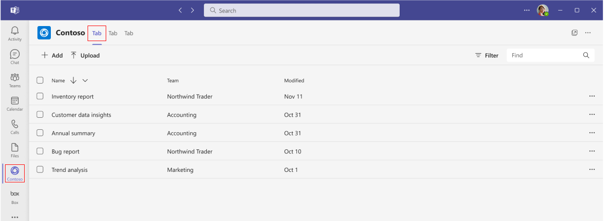
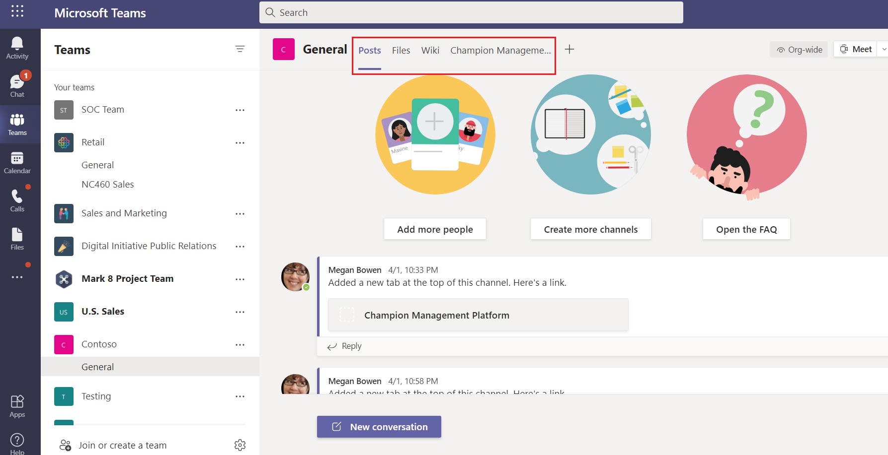

## Module 1 - Tab Apps

- Tabs are Teams-aware webpages embedded in Microsoft Teams.
- They're simple HTML `<iframe/>` tags that point to domains declared in the app manifest and can be added as part of a channel inside a team, group chat, or personal app for an individual user
- You can include custom tabs with your app to embed your own web content in Teams or add Teams-specific functionality to your web content.

The following image shows personal tabs:

The following image shows Contoso channel tabs:

### Tabs User Scenarios

**Scenario:** Bring an existing web-based resource inside Teams.
**Example:** You create a personal tab in your Teams app that presents an informational corporate website to users.

**Scenario:** Add support pages to a Teams bot or messaging extension.
**Example:** You create personal tabs that provide about and help webpage content to users.

**Scenario:** Provide access to items that your users interact with regularly for cooperative dialogue and collaboration.
**Example:** You create a channel or group tab with deep linking to individual items.
