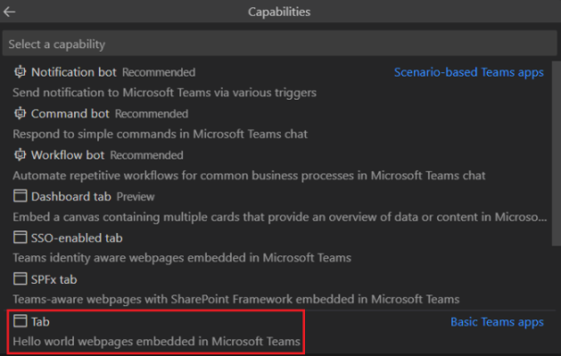
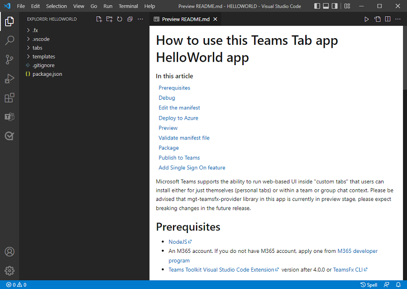
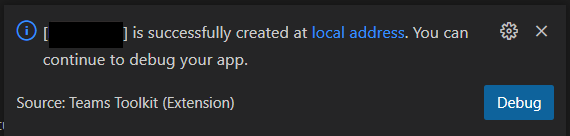
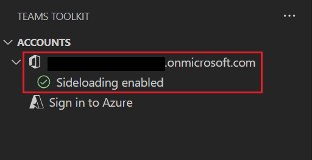
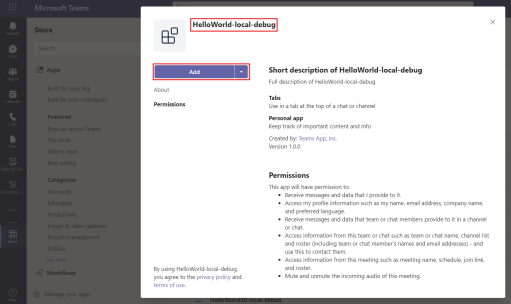
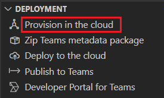
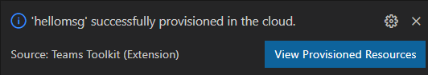
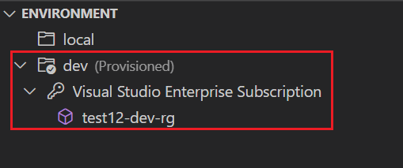
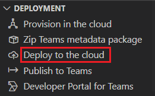
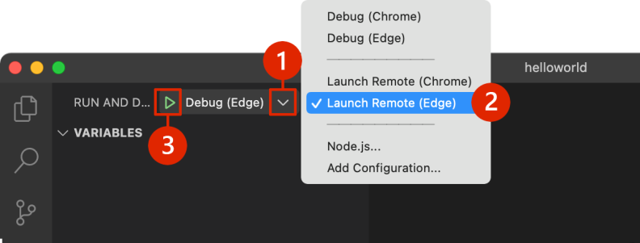

# Module 1 - Tab App Using JavaScript

In this tutorial, you learn:

- How to set up a new project with Teams Toolkit.
- How to build a tab app.
- The structure of the app:
  - The tab portion with JavaScript using React.
  - The rest of the features with Node.js.
- How to deploy your app.

## Create your tab project workspace

1. Open Visual Studio Code.

2. Select the Teams Toolkit  icon in the Visual Studio Code Activity Bar.

3. Select **Create a new app**.

4. Select **Create a new Teams app** to create an app using Teams Toolkit.

5. Ensure that **Tab** is selected as the capability that you want to build in your app. Select OK.

6. Select **JavaScript** as the programming language.

7. Select **Default folder** to store your project root folder in default location

8. Enter **HelloWOrld** name for your app. Select **Enter**.
   The Teams tab app is created in a few seconds.
  
9. After your app is created, Teams Toolkit displays the following message:
You can select **Local debug** to preview your project.
10. Use your Microsoft 365 account to sign in to Teams.
  1. Select the Teams Toolkit  icon in the sidebar.
  1. Select **Sign in to M365**.
  1. Return to Teams Toolkit within Visual Studio Code.
  1. The **ACCOUNTS** section of the sidebar shows your Microsoft 365 account name. Teams Toolkit displays **Sideloading enabled** if sideloading is enabled for your Microsoft 365 account .
11. To build and run your app locally, select F5 to run the application in debug mode.

12. Select Add when prompted to sideload the app onto Teams on your local machine.
  

13. Congratulations, your first app is running on Teams!

## Deploy and run your app in Azure

1. Select the Teams Toolkit  icon

1. Select **Sign in to Azure**.

1. Close the browser when prompted and return to Visual Studio Code.

1. Select the Teams Toolkit  icon

1. Select **Provision in the Cloud**. 

1. Select anyone of the existing subscription.

1. Select or create a **Resource Group** to use for the Azure resources.

1. Select **Provision**.

1. After a few minutes, you see the following notice:

1. The provisioned resource appears in the **Environment** section.

1. Select **Deploy to the Cloud** from the **Deployment** panel after provisioning is complete.

1. Open the debug panel (**Ctrl+Shift+D** / **⌘⇧-D or View > Run**) from Visual Studio Code.

1. Select **Launch Remote (Edge)** from the launch configuration drop-down.

1. Select the **Start debugging (F5)** to launch your app from Azure.

1. Select **Add** when prompted to sideload the app onto Teams.

Congratulations, your first tab app is running in your Azure environment! 